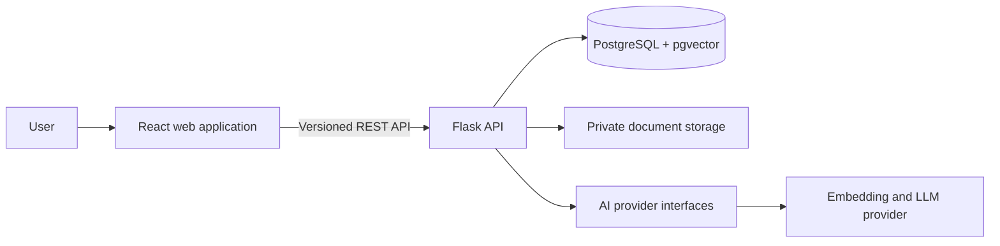
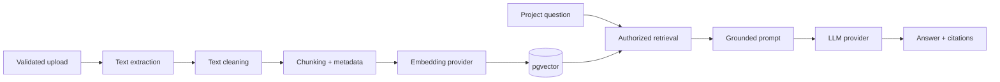

# ProjectAtlas Architecture

## Status

This document records the initial architecture plan. Components described here are not implemented until their corresponding milestone is completed.

## System Overview

The repository uses a monorepo so frontend, backend, infrastructure, tests, and documentation can evolve together while retaining clear application boundaries.

## Frontend

The frontend will use React and TypeScript, with Tailwind CSS as the primary styling system. Server state, authentication state, and local interface state will remain separate. A small reusable component layer will support accessibility and consistent loading, empty, success, and error states.

## Backend

The Flask API will use an application factory and feature-oriented modules instead of a single application file. HTTP handlers will validate and translate requests; service modules will own business workflows; persistence and external providers will remain replaceable at their boundaries.

All project-scoped operations will enforce authorization on the server. A project identifier supplied by a client will never be treated as proof of access.

## Data

PostgreSQL is the system of record for users, projects, memberships, documents, chunks, tasks, decisions, analyses, activity, and authentication state. Foreign keys and migrations will preserve relational integrity. pgvector is planned for semantic search so embeddings and their document metadata can be queried together.

## Document Ingestion and RAG

Ingestion, embedding, retrieval, prompt construction, and generation will be separate services. Chunks will retain document, page, and chunk metadata for citations. Structured model output will be schema-validated before it can affect stored project data, and suggested decisions or tasks will require user confirmation.

## Reliability and Security Boundaries

- Credentials are supplied only through environment variables.
- Upload type, size, and filename are validated before processing.
- AI failures do not disable project, task, or document-management features.
- Automated tests use fake providers and never make paid AI calls.
- API errors use a stable public shape and do not expose stack traces.
- Authorization checks are applied to every project-owned resource.

## Initial Decisions and Alternatives

### Monorepo

A monorepo keeps portfolio review, local setup, and coordinated changes straightforward. Separate repositories could provide stronger deployment isolation, but would add workflow overhead without improving this MVP.

### Flask

Flask makes application composition and service boundaries explicit, which is useful for demonstrating backend design. FastAPI would provide stronger built-in typing and OpenAPI generation; Django would provide more batteries out of the box. Flask is retained because it is a project requirement and remains suitable with disciplined modular structure.

### PostgreSQL and pgvector

Keeping relational data and vectors in PostgreSQL reduces operational complexity and makes metadata filtering straightforward. A dedicated vector database could scale independently, but is unnecessary for the expected portfolio workload.

### Synchronous ingestion first

The first ingestion pipeline will be synchronous but isolated behind a service boundary. A background queue is appropriate once processing latency or volume justifies the added operational complexity.

