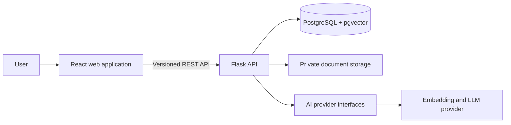
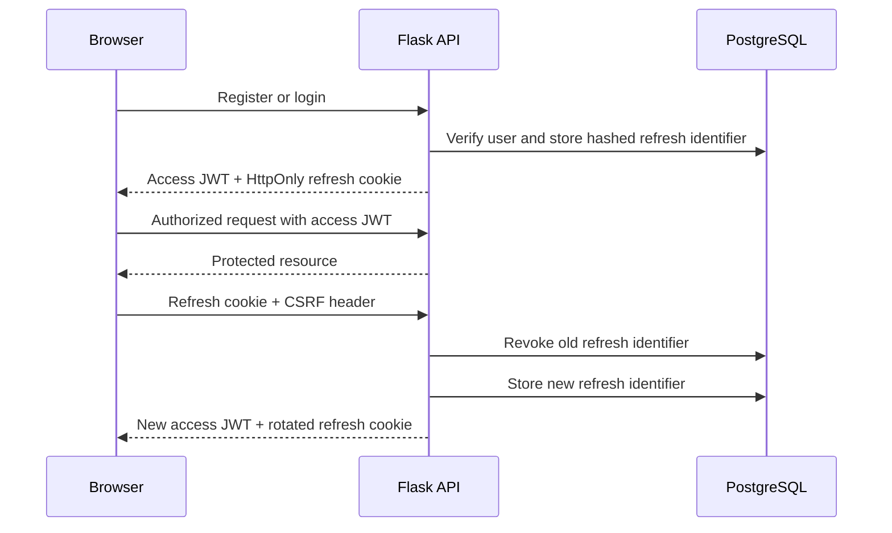
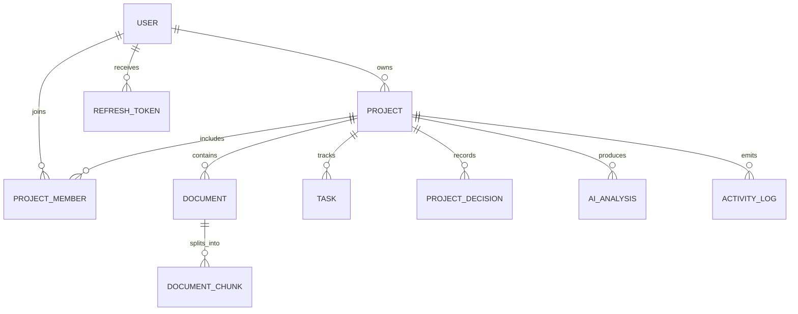
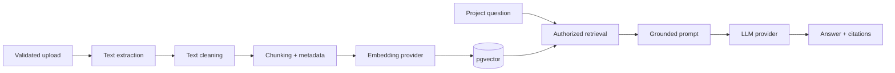

# ProjectAtlas Architecture

## Status

ProjectAtlas implements the complete portfolio MVP: authenticated project workspaces, tasks, document ingestion, vector retrieval, grounded assistant responses, citations, decision review, structured analysis, AI task conversion, activity dashboards, containers, and CI.

## System Overview

The repository uses a monorepo so frontend, backend, infrastructure, tests, and documentation can evolve together while retaining clear application boundaries.

## Frontend

The frontend uses React and TypeScript, with Tailwind CSS as the primary styling system. The responsive application shell, routing, reusable components, authenticated server integration, project tools, and live dashboard are implemented. Authentication state remains in a focused context; request data and transient interface state stay local to their features.

## Backend

The Flask API uses an application factory, environment-specific configuration, versioned blueprints, restricted CORS, security headers, and a consistent JSON error contract. HTTP handlers validate and translate requests, service modules own business workflows, and persistence and external providers remain replaceable at their boundaries.

All project-scoped operations enforce authorization on the server. A project identifier supplied by a client is never treated as proof of access.

Project management now applies this rule through a shared authorized lookup that joins projects to memberships for the authenticated user. Non-members receive `404` to avoid leaking private project existence. `OWNER` and `ADMIN` may update a project, while destructive deletion is restricted to `OWNER`. Project creation writes the project, owner membership, and initial activity record in one transaction.

Task routes reuse the same authorized project lookup. `VIEWER` memberships are read-only, while other project roles may create, update, change status, and delete tasks. Assignees must already belong to the same project. Task lists support bounded pagination, status and priority filters, and case-insensitive search. Mutations append activity records in the same transaction.

## Authentication

Passwords are hashed with scrypt. Access tokens expire after 15 minutes and are held only in frontend memory. Seven-day refresh tokens use `HttpOnly`, `SameSite=Lax` cookies and double-submit CSRF protection. Refresh identifiers are hashed before persistence and rotated on every use. Logout revokes the active refresh token; existing access tokens are intentionally not stored server-side and remain valid only until their short expiration.

## Data

PostgreSQL is the system of record for users, projects, memberships, documents, chunks, tasks, decisions, analyses, activity, and refresh-token state. SQLAlchemy models and versioned Alembic migrations define the schema. Foreign keys, unique constraints, enums, and targeted indexes preserve integrity. pgvector performs project-filtered semantic search beside transactional metadata.

UUID primary keys are used for externally referenced entities. Project membership is modeled explicitly so authorization can evolve from ownership to role-based access. AI-detected decisions carry a pending state until a user confirms or rejects them, and refresh tokens are represented by hashes rather than raw credentials.

## Document Ingestion and RAG

Ingestion, embedding, retrieval, prompt construction, and generation are separate services. Chunks retain document, page, and chunk metadata for citations. Structured model output is schema-validated before it affects stored data, and suggested decisions or tasks require explicit user action.

The implemented ingestion stage validates PDF, TXT, and Markdown uploads, saves them beneath a private configured storage root, and extracts text through format-specific functions. PDF pages are separated with form-feed boundaries so page metadata can be preserved during later chunking. Malformed or textless documents transition to `FAILED` with a safe public error instead of breaking unrelated application workflows. Processing is synchronous for now but isolated from HTTP routing so it can move to a background worker later.

## Reliability and Security Boundaries

- Credentials are supplied only through environment variables.
- Upload type, size, and filename are validated before processing.
- AI failures do not disable project, task, or document-management features.
- Automated tests use fake providers and never make paid AI calls.
- API errors use a stable public shape and do not expose stack traces.
- Authorization checks are applied to every project-owned resource.

## Initial Decisions and Alternatives

### Monorepo

A monorepo keeps portfolio review, local setup, and coordinated changes straightforward. Separate repositories could provide stronger deployment isolation, but would add workflow overhead without improving this MVP.

### Flask

Flask makes application composition and service boundaries explicit, which is useful for demonstrating backend design. FastAPI would provide stronger built-in typing and OpenAPI generation; Django would provide more batteries out of the box. Flask is retained because it is a project requirement and remains suitable with disciplined modular structure.

### PostgreSQL and pgvector

Keeping relational data and vectors in PostgreSQL reduces operational complexity and makes metadata filtering straightforward. A dedicated vector database could scale independently, but is unnecessary for the expected portfolio workload.

### Synchronous ingestion

The ingestion pipeline is synchronous but isolated behind a service boundary. A background queue is appropriate once processing latency or volume justifies the added operational complexity.

## Delivery

Docker Compose runs Nginx, the React production build, Gunicorn, Flask, and PostgreSQL with pgvector. The backend container applies migrations before serving traffic and writes uploads to a named volume. GitHub Actions independently validates Python and TypeScript quality gates, then verifies both container builds.
