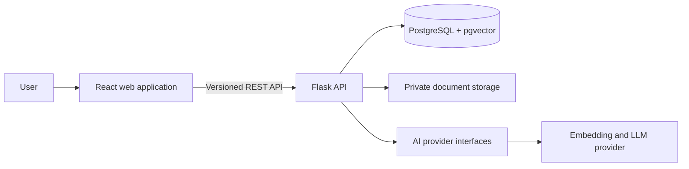
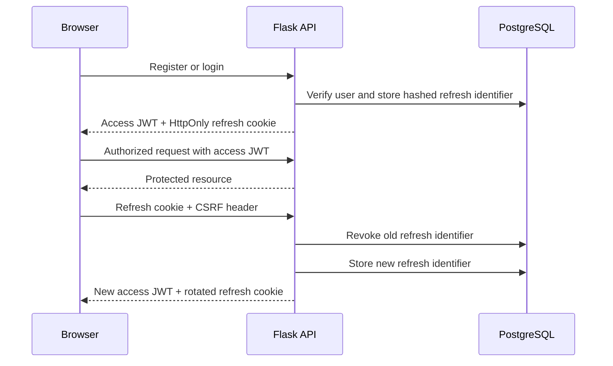
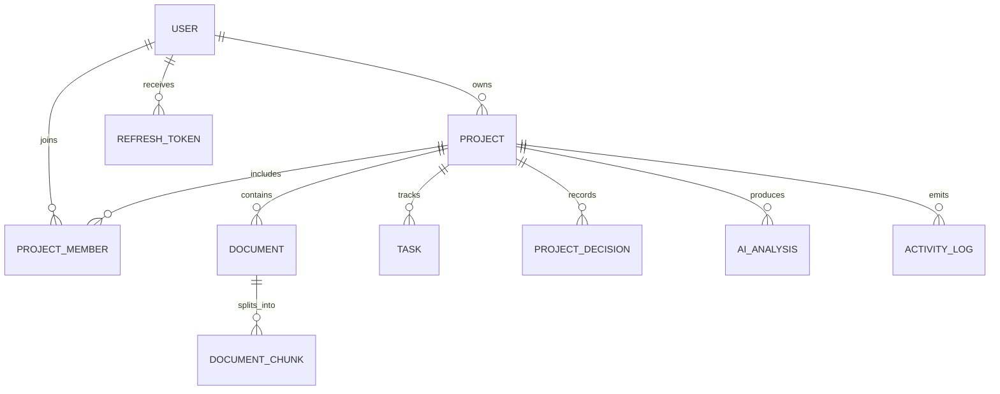
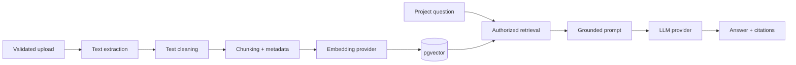

# ProjectAtlas Architecture

## Status

This document distinguishes the implemented foundation from planned components. The React application shell, Flask API foundation, relational models, authentication, project management, and task workflows are implemented; document and AI workflows remain planned.

## System Overview

The repository uses a monorepo so frontend, backend, infrastructure, tests, and documentation can evolve together while retaining clear application boundaries.

## Frontend

The frontend uses React and TypeScript, with Tailwind CSS as the primary styling system. Its responsive application shell, routing, initial reusable components, and mock dashboard are implemented. Server state, authentication state, and local interface state will remain separate as data integration is introduced.

## Backend

The Flask API uses an application factory, environment-specific configuration, versioned blueprints, restricted CORS, and a consistent JSON error contract. HTTP handlers will validate and translate requests; service modules will own future business workflows; persistence and external providers will remain replaceable at their boundaries.

All project-scoped operations will enforce authorization on the server. A project identifier supplied by a client will never be treated as proof of access.

Project management now applies this rule through a shared authorized lookup that joins projects to memberships for the authenticated user. Non-members receive `404` to avoid leaking private project existence. `OWNER` and `ADMIN` may update a project, while destructive deletion is restricted to `OWNER`. Project creation writes the project, owner membership, and initial activity record in one transaction.

Task routes reuse the same authorized project lookup. `VIEWER` memberships are read-only, while other project roles may create, update, change status, and delete tasks. Assignees must already belong to the same project. Task lists support bounded pagination, status and priority filters, and case-insensitive search. Mutations append activity records in the same transaction.

## Authentication

Passwords are hashed with scrypt. Access tokens expire after 15 minutes and are held only in frontend memory. Seven-day refresh tokens use `HttpOnly`, `SameSite=Lax` cookies and double-submit CSRF protection. Refresh identifiers are hashed before persistence and rotated on every use. Logout revokes the active refresh token; existing access tokens are intentionally not stored server-side and remain valid only until their short expiration.

## Data

PostgreSQL is the system of record for users, projects, memberships, documents, chunks, tasks, decisions, analyses, activity, and refresh-token state. SQLAlchemy models and an Alembic migration now define the initial schema. Foreign keys, unique constraints, enums, and targeted indexes preserve integrity and support expected access patterns. pgvector remains planned for semantic search so embeddings and their document metadata can be queried together.

UUID primary keys are used for externally referenced entities. Project membership is modeled explicitly so authorization can evolve from ownership to role-based access. AI-detected decisions carry a pending state until a user confirms or rejects them, and refresh tokens are represented by hashes rather than raw credentials.

## Document Ingestion and RAG

Ingestion, embedding, retrieval, prompt construction, and generation will be separate services. Chunks will retain document, page, and chunk metadata for citations. Structured model output will be schema-validated before it can affect stored project data, and suggested decisions or tasks will require user confirmation.

## Reliability and Security Boundaries

- Credentials are supplied only through environment variables.
- Upload type, size, and filename are validated before processing.
- AI failures do not disable project, task, or document-management features.
- Automated tests use fake providers and never make paid AI calls.
- API errors use a stable public shape and do not expose stack traces.
- Authorization checks are applied to every project-owned resource.

## Initial Decisions and Alternatives

### Monorepo

A monorepo keeps portfolio review, local setup, and coordinated changes straightforward. Separate repositories could provide stronger deployment isolation, but would add workflow overhead without improving this MVP.

### Flask

Flask makes application composition and service boundaries explicit, which is useful for demonstrating backend design. FastAPI would provide stronger built-in typing and OpenAPI generation; Django would provide more batteries out of the box. Flask is retained because it is a project requirement and remains suitable with disciplined modular structure.

### PostgreSQL and pgvector

Keeping relational data and vectors in PostgreSQL reduces operational complexity and makes metadata filtering straightforward. A dedicated vector database could scale independently, but is unnecessary for the expected portfolio workload.

### Synchronous ingestion first

The first ingestion pipeline will be synchronous but isolated behind a service boundary. A background queue is appropriate once processing latency or volume justifies the added operational complexity.
